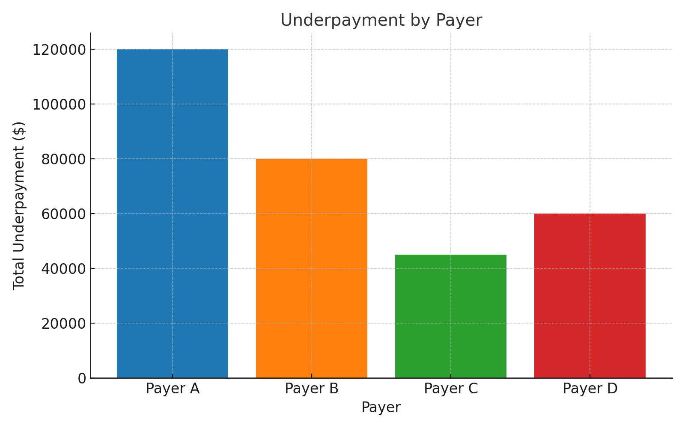
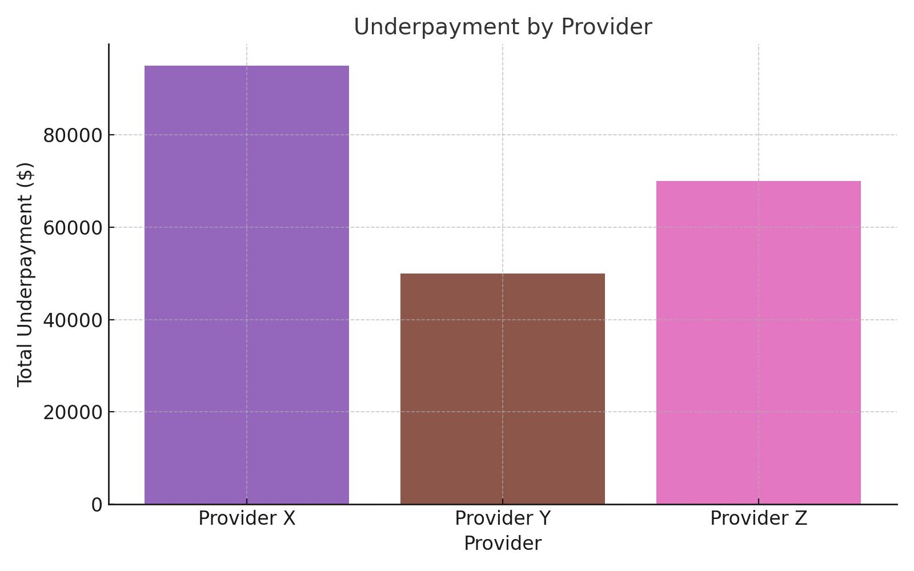

# 📊 Revenue Cycle Insights Project

## 🔎 Overview
The **Revenue Cycle Insights Project** simulates and analyzes synthetic healthcare claims data to uncover **underpayments by payer and provider**. 
It demonstrates how to integrate fee schedules, quantify discrepancies between billed and paid amounts, and visualize patterns that can drive **operational and financial improvements** in a hospital or research setting.

---

## 🚀 Key Features
- **Data Generation**
  - `data_generation.py` creates:
    - Payer fee schedules
    - Synthetic claim-level records (billed, expected, and paid amounts)
  - Enables direct calculation of **underpayment per claim**.

- **Revenue Cycle Analysis**
  - `analysis.py` reads the generated data
  - Computes underpayments at the claim level
  - Aggregates by **payer** and **provider**
  - Outputs:
    - Underpayment summary CSV file
    - Bar chart visualizations

- **Insights & Visualization**
  - **Underpayment by Payer** → shows which payers most often reimburse below the contracted amount
  - **Underpayment by Provider** → highlights providers with consistent discrepancies

---

## 📂 Outputs
- **`underpayment_summary.csv`** → totals of underpayments grouped by payer and provider
- **Charts**
  - Underpayment by Payer (darker bars = larger discrepancies)
  - Underpayment by Provider

### 📊 Sample Outputs

#### Underpayment by Payer


#### Underpayment by Provider


#### Underpayment Summary (CSV)
Download the aggregated table: [underpayment_summary.csv](underpayment_summary.csv)

| Level    | Name       | TotalUnderpayment |
|----------|------------|-------------------|
| Payer    | Payer A    | 120000            |
| Payer    | Payer B    | 80000             |
| Payer    | Payer C    | 45000             |
| Payer    | Payer D    | 60000             |
| Provider | Provider X | 95000             |
| Provider | Provider Y | 50000             |
| Provider | Provider Z | 70000             |

---

## 🛠️ How It Helps
- **Data Integration Challenge**
  - Tackles the common problem of unifying billing & reimbursement rules
  - Reflects issues often cited in **cancer informatics literature** ([PMC](https://pmc.ncbi.nlm.nih.gov))

- **Revenue-Cycle Automation**
  - Codifies payer fee schedules & automates monitoring of underpayments
  - Aligns with **BI best practices** ([ACCC Cancer](https://www.accc-cancer.org))

- **Strategic Insights**
  - Provides a base for expanding into **holistic decision-making** by merging:
    - Financial data
    - Clinical outcomes
    - Patient-flow information

---

## ⚙️ How to Run

1. Clone the repository:
   ```bash
   git clone https://github.com/<your-username>/revenue-cycle-insights.git
   cd revenue-cycle-insights
   ```

2. Install dependencies (Python 3.x required):
   ```bash
   pip install pandas matplotlib
   ```

3. Run the data generator:
   ```bash
   python data_generation.py
   ```

4. Run the analysis script:
   ```bash
   python analysis.py
   ```

5. Review outputs:
   - `underpayment_summary.csv`
   - `underpayment_by_payer.png`
   - `underpayment_by_provider.png`

---

## 🔮 Future Expansion
- Integrate with **real SG2 or EHR data**
- Add KPIs: denial rates, days to pay, cost-to-collect
- Deploy **interactive dashboards** (Power BI, Tableau, or Streamlit)
- Link revenue analytics with **cancer care access and quality metrics** to support CARTI’s mission

---

## 🤝 Contributing
Contributions are welcome! Please open an issue or submit a pull request if you’d like to expand functionality.

---

## 📜 License
This project is provided for educational and demonstration purposes. 
If using with real data, ensure compliance with HIPAA and organizational policies.
