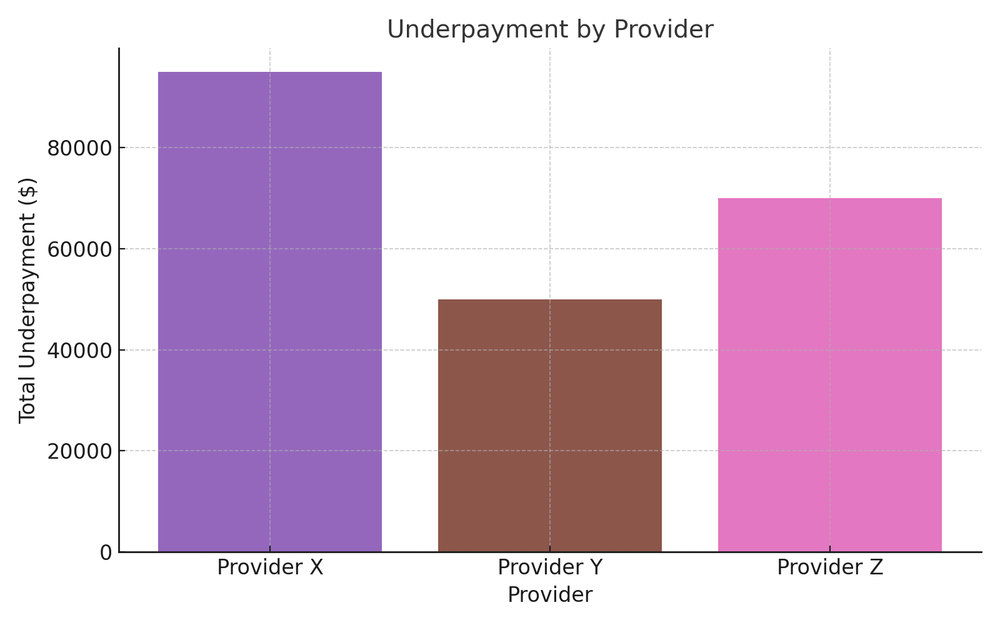

# 📊 Revenue Cycle Insights Project

## Sample Outputs

### Underpayment by Payer

### Underpayment by Provider

### Underpayment Summary (CSV)
Download the aggregated table: [underpayment_summary.csv](underpayment_summary.csv)

| Level    | Name       | TotalUnderpayment |
|----------|------------|-------------------|
| Payer    | Payer A    | 120000            |
| Payer    | Payer B    | 80000             |
| Payer    | Payer C    | 45000             |
| Payer    | Payer D    | 60000             |
| Provider | Provider X | 95000             |
| Provider | Provider Y | 50000             |
| Provider | Provider Z | 70000             |

